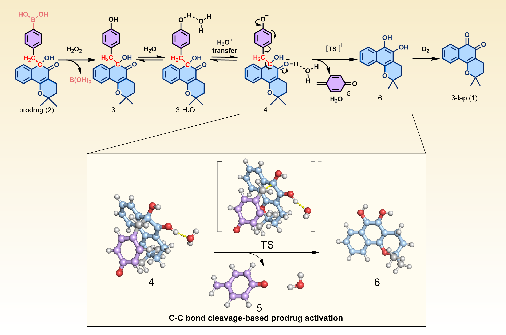

# Understanding Carbon-Carbon Bond Cleavage in Prodrug Design

## Background

### What is a Prodrug?

A prodrug is an inactive medication that converts to its active form after being metabolized in the body. It acts as a delivery vehicle, releasing the active drug at specific target sites.

Prodrugs offer several key advantages: targeted drug delivery with reduced side effects, improved absorption and distribution in the body, and better patient compliance due to enhanced drug properties.

### Traditional vs C-C Bond Prodrug Strategies
Traditional prodrug approaches have primarily relied on several well-established chemical modifications. These include the formation of ester bonds, amide bonds, and phosphate bonds, along with other easily modifiable chemical groups. While these approaches have proven successful in many cases, they are limited to drugs that contain suitable modification sites.

The carbon-carbon (C-C) bond strategy represents an innovative departure from these conventional approaches. C-C bonds serve as fundamental building blocks in organic molecules, providing exceptional stability during drug transport through the body. What makes this strategy particularly exciting is its ability to enable selective bond cleavage, opening up new possibilities for drugs that previously couldn't be modified using traditional approaches. This innovation is especially valuable for drug molecules that lack conventional modification sites, significantly expanding the range of compounds that can be developed into prodrugs.





## The Case Study: β-lapachone

### The Challenge

We need to determine if a C-C bond-based prodrug will activate under physiological conditions. This requires calculating:
1. The energy barrier for bond breaking (activation energy)
2. The overall energy change of the reaction (Gibbs free energy)
3. The effects of the body's water-based environment (solvation effects)

### Our Computational Approach

Here we show the code for the energy calculation. The complete code can be found in the [c_c_bond folder](https://github.com/AceMapAI-Biotech/qc-drug-design/tree/main/c_c_bond).

#### 1. System Simplification

To make the calculations feasible on current quantum computers, we reduce the complex molecular system to a manageable size. This is necessary because current quantum computers can only handle a limited number of qubits reliably. We employ the active space approximation, which focuses on the most chemically relevant electrons and orbitals - in this case, those involved in the C-C bond cleavage.

The code below demonstrates how we implement this reduction using a (2e, 2o) active space - meaning we consider 2 electrons in 2 orbitals. We use the Hardware Efficient Ansatz (HEA) for the quantum computation, which is well-suited for near-term quantum devices:

```python
# From qc.py - showing how we handle the active space reduction
basis = "6-311g(d,p)"
mol_eq = M(atom=geom_gaussian6, basis=basis)
ne, no = 2, 2  # 2 electrons, 2 orbitals active space

# Quantum computation setup
if do_qc:
    hea = HEA.from_molecule(mol_eq, active_space=(ne, no), n_layers=1)
    hea.kernel()
    hea.print_summary()
    print(hea.energy(engine=qc_engine))
else:
    hf = mol_eq.HF()
    print(hf.kernel())
    casci = CASCI(hf, no, ne)
    casci.kernel()
```

After this reduction, the quantum computation becomes tractable while still capturing the essential physics of the C-C bond breaking process. The HEA implementation uses a single layer of quantum gates to minimize the impact of hardware noise while maintaining sufficient flexibility to describe the electronic state.

#### 2. Computational Methods
We employed three different approaches to validate our results. This multi-method approach allows us to cross-validate our findings and understand the trade-offs between classical and quantum methods. The code below shows how we implement these three approaches - Hartree-Fock (HF) for a baseline calculation, Complete Active Space Configuration Interaction (CASCI) for a more accurate classical result, and Variational Quantum Eigensolver (VQE) for the quantum computation:

```python
# From qc.py - showing our computational methods
# Classical HF calculation
hf = mol_eq.HF()
print(hf.kernel())

# CASCI calculation
casci = CASCI(hf, no, ne)
casci = solvent.ddCOSMO(casci)
casci.canonicalization = False

# Quantum computation using VQE
if do_qc:
    # Set the FCI solver for CASSCF to be HEA
    casci.fcisolver = HEA.as_pyscf_solver(
        engine=qc_engine, 
        opt_engine="tensornetwork", 
        n_layers=1
    )
casci.with_solvent.max_cycle = 0
casci.verbose = logger.INFO
print(casci.kernel()[0])
```

The CASCI calculation includes solvent effects through the ddCOSMO model, and we've disabled canonicalization to maintain consistency with the quantum computation. For the quantum calculation, we use the HEA solver with tensornetwork optimization, which provides a good balance between accuracy and computational efficiency.

#### 3. Solvation Effects
Water plays a crucial role in drug activation processes in the body, so accurately modeling solvation effects is essential. We use the conductor-like screening model (COSMO) implemented in ddCOSMO, which provides an efficient way to account for the water environment without explicitly modeling water molecules. This approach treats the solvent as a continuous medium characterized by its dielectric constant:

```python
# From energy_calculate.py - showing solvation calculations
from pyscf import gto, scf, solvent
from pyscf.solvent import ddCOSMO

# Setup molecule
mol = gto.Mole()
mol.atom = """[molecular coordinates]"""  # Coordinates omitted
mol.basis = "6-311+g(d,p)"
mol.charge = 0
mol.spin = 0
mol.build()

# HF calculation
mf = scf.RHF(mol)
mf = scf.RHF(mol).run()

# COSMO solvation calculation
with_solvent_ddcosmo = ddCOSMO(mf).run()

# Frequency analysis involving Hessian calculation
hess = rhf.Hessian(with_solvent_ddcosmo).kernel()
```

The calculation proceeds in several steps:
1. First, we set up the molecular system with appropriate basis sets and parameters
2. Then we perform a Hartree-Fock calculation to get the baseline electronic structure
3. Next, we apply the COSMO solvation model to account for water effects
4. Finally, we perform a frequency analysis to verify the stability of our results and ensure we haven't found an unstable transition state

This approach allows us to capture the essential physics of solvation while maintaining computational efficiency, which is crucial when working with quantum computers that have limited coherence times.

## Results and Analysis

### Energy Barriers and Reaction Energies
| Method | ΔG‡ with solvent | ΔG‡ without solvent | ΔG with solvent | ΔG without solvent |
|--------|------------------|--------------------|-----------------|--------------------|
| HF     | 13.1            | 2.6                | -41.1           | -59.3             |
| CASCI  | 11.8            | 1.4                | -49.5           | -68.0             |
| VQE    | 7±5             | -4±7               | -51±11          | -65±9             |
| DFT*   | 8.3             | ---                | -10.8           | ---               |

*DFT values are from previous work using M06-2X functional

All energies are measured in kcal/mol. ΔG‡ represents the reaction barrier (activation energy), while ΔG represents the overall Gibbs free energy change of the reaction.

### Key Findings

Our analysis reveals that the activation barrier falls below 20 kcal/mol, a crucial threshold in drug design. This relatively low energy barrier indicates that the reaction can proceed spontaneously under normal physiological conditions, without requiring external activation. These computational results align well with experimental observations, providing strong validation for our approach. The consistency between different methods (HF, CASCI, VQE, and previous DFT calculations) in predicting feasible activation barriers adds confidence to our findings.

The presence of water dramatically influences the energy barriers in our calculations. When we exclude water effects from our computations, the results become unrealistic and unreliable. This became particularly evident in our VQE calculations, which produced non-physical negative barriers when solvation effects were ignored. The dramatic difference between solvated and unsolvated calculations (e.g., 13.1 vs 2.6 kcal/mol for HF) emphasizes the critical importance of including solvent effects in any meaningful drug activation calculations.

Our performance analysis revealed significant differences between classical and quantum approaches. Classical computation using CASCI completed in approximately 3 seconds, while quantum computation using VQE required about 63 seconds. The quantum computation time can be broken down into several components: it required 8192 measurement shots, with each shot taking approximately 1 millisecond. We needed to measure 8 different Pauli strings, which we organized into 5 measurement groups to optimize the process.

**Method Comparison**:
- The reaction barriers (ΔG‡) from all methods are reasonably consistent, ranging from 7-13 kcal/mol with solvent
- The overall reaction energies (ΔG) show larger variations between methods, particularly for DFT
- VQE results show larger uncertainties but generally agree with classical methods within error bars
- The inclusion of solvent effects consistently shows a significant impact across all methods

## Practical Implications

### For Drug Design
Our research provides strong validation for using carbon-carbon bond cleavage as a viable prodrug strategy. The computational framework we've developed offers a reliable way to predict prodrug activation under physiological conditions, which is crucial for drug development. Perhaps most importantly, our work demonstrates that including solvent effects is absolutely essential for accurate predictions - without accounting for the water-based environment of the body, calculations can lead to misleading or incorrect results.

### For Quantum Computing
This study represents a significant step forward in applying quantum computing to real-world drug design challenges. While our work highlights the current limitations of quantum computers - particularly the need to simplify molecular systems to make them computationally tractable - it also demonstrates how quantum and classical methods can be successfully integrated to solve complex problems. The performance benchmarks we've established provide valuable reference points for future quantum computing applications in pharmaceutical research, helping set realistic expectations and identify areas for improvement.

