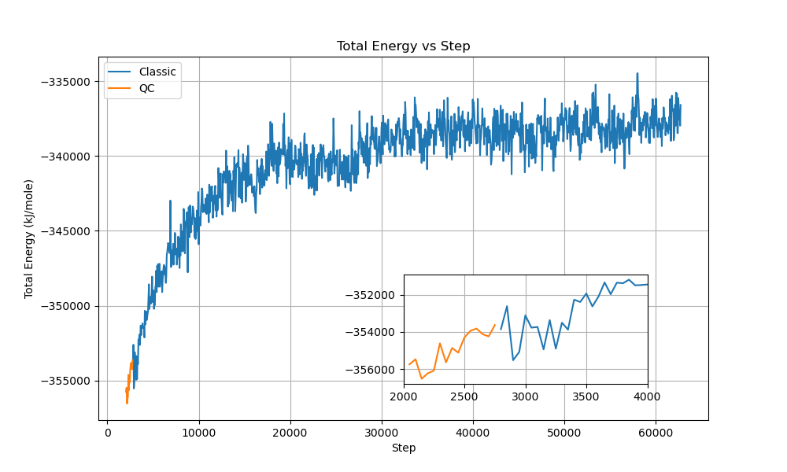

# Quantum Computing for KRAS Covalent Bond Simulation

## Introduction

This post demonstrates how quantum computing can enhance our understanding of covalent drug-target interactions, focusing on the KRAS G12C mutation and its inhibitor Sotorasib. We'll show how to set up and run quantum mechanics/molecular mechanics (QM/MM) simulations to study the formation and stability of covalent bonds in drug-protein interactions. Our approach combines classical molecular dynamics with quantum computing to achieve more accurate results while keeping computational costs manageable.

### What is KRAS and Why is it Important?

KRAS (Kirsten rat sarcoma viral oncogene) is a crucial protein involved in the RAS/MAPK signaling pathway, which controls cell growth, differentiation, and survival. Mutations in KRAS, particularly the G12C variant, are common in various cancers including:
- Lung cancer
- Pancreatic cancer
- Colorectal cancer

These mutations lead to uncontrolled cell proliferation and cancer progression. The G12C mutation has been particularly interesting for drug development because it offers a unique opportunity for covalent inhibition.

### The Breakthrough: Sotorasib (AMG 510)

Sotorasib, also known as AMG 510, represents a major advancement in KRAS inhibition. It's designed to form a covalent bond with the mutated cysteine in KRAS G12C, providing:
- Longer-lasting inhibition
- More specific targeting
- Better efficacy compared to traditional reversible inhibitors


## The Challenge

Simulating covalent bond formation and stability between a drug and its protein target is computationally intensive. Traditional approaches have limitations:

1. Classical molecular dynamics can't accurately model electronic effects
2. Full quantum mechanical calculations are too expensive for large systems
3. Hybrid QM/MM methods need careful setup and validation

Our solution combines quantum computing with classical methods to achieve both accuracy and efficiency.

## Our Computational Approach

### Step 1: System Preparation

First, we need to prepare our molecular system:

1. Start with the crystal structure of KRAS G12C bound to Sotorasib (PDB: 6OIM)
2. Process the structure using Amber tools:
```bash
# Convert PDB to Amber format
pdb4amber -i 6oim.pdb -o 6oim_processed.pdb

# Generate force field parameters
antechamber -i sotorasib.mol2 -fi mol2 -o sotorasib.prepi -fo prepi -c bcc -nc 0

# Check for missing parameters
parmchk2 -i sotorasib.prepi -f prepi -o sotorasib.frcmod

# Create the system topology
tleap -f setup.in
```

### Step 2: QM Region Selection

The QM region is crucial - it needs to include all atoms involved in the covalent bond formation while keeping the calculation tractable. We selected five key atoms:

1. SG: The sulfur atom of cysteine 12
2. C18: The carbon atom from Sotorasib that forms the covalent bond
3. C17: Adjacent carbon affecting the bond
4. O16: Nearby oxygen influencing electronic structure
5. C15: Supporting carbon atom


### Step 3: Setting Up the QM/MM Simulation

We use OpenMM for molecular dynamics and PySCF for quantum calculations. Here's how to set up the hybrid simulation:

```python
# From covalent_bond/QMMM/6oim_sotorasib_qmmm_verify.py
from openmm import app
import openmm as mm
from openmm import unit
import numpy as np
from loguru import logger
from pyscf import gto, scf, solvent

# Load the system
prmtop = app.AmberPrmtopFile('6oim_CYX_amber_success.prmtop')
inpcrd = app.AmberInpcrdFile('6oim_CYX_amber_success.inpcrd')

# Create system with periodic boundary conditions
system = prmtop.createSystem(nonbondedMethod=app.PME,
                           nonbondedCutoff=1*unit.nanometer,
                           constraints=app.HBonds)

# Add barostat for pressure coupling
pressure = 1.0 * unit.atmospheres
temperature = 300 * unit.kelvin
barostatInterval = 25
system.addForce(mm.MonteCarloBarostat(pressure, temperature, barostatInterval))

# Set up integrator
timestep = 2 * unit.femtoseconds
friction = 468 / unit.picosecond
integrator = mm.CustomIntegrator(timestep)

# Configure integrator
integrator.addUpdateContextState()
kB = unit.BOLTZMANN_CONSTANT_kB * unit.AVOGADRO_CONSTANT_NA
integrator.addGlobalVariable("kT", kB.value_in_unit_system(unit.md_unit_system) * temperature.value_in_unit(unit.kelvin))
integrator.addGlobalVariable("friction", friction.value_in_unit(unit.picosecond**-1))

# Add velocity verlet with friction
integrator.addComputePerDof("v", "v + 0.5*dt*f/m - dt*friction*v + sqrt(2*friction*kT*dt)*gaussian/m")
integrator.addComputePerDof("x", "x+dt*v")
integrator.addConstrainPositions()
integrator.addConstrainVelocities()

# Create simulation object
try:
    platform = mm.Platform.getPlatformByName('CUDA')
    properties = {'CudaPrecision': 'mixed', 'CudaDeviceIndex': '0,1,2,3,4,5'}
    simulation = app.Simulation(prmtop.topology, system, integrator, platform, properties)
except:
    simulation = app.Simulation(prmtop.topology, system, integrator)

# Define QM region (using zero-based indexing)
qm_atoms = [189, 190, 191, 257, 192]  # SG, C18, C17, O16, C15
atom_names = [atom.element.symbol for atom in prmtop.topology.atoms()]
mm_atoms = list(set(range(system.getNumParticles())) - set(qm_atoms))

# Create QM/MM force
qmmm_force = mm.CustomExternalForce('E_qm')
qmmm_force.addGlobalParameter('E_qm', 0.0)
for i in qm_atoms:
    qmmm_force.addParticle(i)
system.addForce(qmmm_force)
```

### Step 4: Quantum Computing Implementation

```python
# From covalent_bond/QMMM/6oim_sotorasib_qmmm_verify.py
def setup_quantum_calculation(mol):
    # Initialize Hartree-Fock
    hf = mol.HF()
    hf.kernel()

    # Set up CASCI with (2e, 2o) active space
    casci = CASCI(hf, 2, 2)  # 2 electrons in 2 orbitals

    # Configure Hardware Efficient Ansatz
    casci.canonicalization = False
    casci.fcisolver = HEA.as_pyscf_solver()

    # Run quantum computation
    energy = casci.kernel()[0]
    forces = casci.nuc_grad_method().kernel()

    return energy, forces
```

```python
# From covalent_bond/QMMM/6oim_sotorasib_qmmm_verify.py (lines 67-141)
def update_qm_energy_and_forces(step, integrator, simulation, system):
    # Get current state
    state = simulation.context.getState(getPositions=True, getForces=True)
    coordinates = state.getPositions(asNumpy=True).value_in_unit(unit.angstrom)

    # Get MM atom charges and coordinates
    mm_atom_charges = [system.getParticleMass(index).value_in_unit(unit.dalton) for index in mm_atoms]
    mm_atom_coords = [coordinates[i] for i in mm_atoms]
    mm_atom_coords_angstrom = np.array(mm_atom_coords) * unit.angstrom
    mm_atom_coords_bohr = mm_atom_coords_angstrom.value_in_unit(unit.bohr)

    # Get QM atom coordinates and names
    qm_atom_coords = [coordinates[i] for i in qm_atoms]
    qm_atom_names = [atom_names[i] for i in qm_atoms]

    # Setup QM region molecule
    mol = gto.Mole()
    mol.atom = '\n'.join([f'{atom_name} {" ".join(map(str, coord))}' for
                         atom_name, coord in zip(qm_atom_names, qm_atom_coords)])
    mol.basis = '6-31g'
    mol.spin = 0  # No unpaired electrons
    mol.build()

    # Setup QM calculation with density fitting
    calc = scf.RHF(mol).density_fit(auxbasis='cc-pvdz-jkfit')

    # Include MM charges in QM calculation
    calc = pyscf.qmmm.mm_charge(calc, mm_atom_coords_bohr, mm_atom_charges)
    hf = calc

    # Quantum computation
    if do_qc:  # Use quantum computer
        E_qm, forces_qm = setup_quantum_calculation(mol)
    else:  # Use classical computation
        E_qm = hf.kernel()
        forces_qm = -hf.nuc_grad_method().kernel()

    # Update forces in the simulation
    qmmm_force = system.getForce(system.getNumForces() - 1)
    qmmm_force.setGlobalParameterDefaultValue(0, E_qm)

    # Convert and apply forces
    for i, force in enumerate(forces_qm):
        force_in_kJ_per_mol = [f * unit.hartree/unit.bohr for f in force]
        qmmm_force.setParticleParameters(i, qm_atoms[i], force_in_kJ_per_mol)

    return E_qm
```

### Step 5: Running the Simulation

The simulation proceeds in steps, with quantum calculations performed at each step through the custom integrator. The `update_qm_energy_and_forces` function is called automatically by the integrator to:

1. Calculate QM energies and forces using either classical or quantum methods
2. Update the forces in the MM simulation
3. Integrate the motion using the velocity Verlet algorithm with friction

The quantum computation involves several key components:

1. **Active Space Approximation**: We use a (2e, 2o) active space, meaning we consider 2 electrons in 2 orbitals. This simplification makes the problem tractable for current quantum computers while still capturing the essential physics of the covalent bond.

2. **Hardware Efficient Ansatz**: Our quantum circuit uses a single layer of parameterized gates. This design minimizes the impact of quantum hardware noise while maintaining sufficient flexibility to describe the electronic state.

3. **Measurement Strategy**: For each energy evaluation:
   - We need 8192 measurement shots per Pauli operator
   - There are 8 Pauli strings to measure
   - These are organized into 5 measurement groups based on commutation relations
   - Each shot takes approximately 1ms
   - Total measurement time per energy evaluation: ~40 seconds

4. **Performance Considerations**:
   - Classical CASCI computation: ~3 seconds
   - Quantum VQE computation: ~63 seconds
   - Additional time for density matrix measurements: ~20 seconds
   - Total quantum overhead per step: ~83 seconds

The quantum computation provides several advantages:
- More accurate electronic structure description
- Ability to handle strong correlation effects
- Potential for scaling to larger active spaces as quantum hardware improves

## Results and Analysis

The energy profile shows proper equilibration and stability throughout the simulation:


The total energy of the system stabilizes after an initial equilibration phase, with values ranging from -355,000 to -354,000 kJ/mol. The QM region energy evolution shows consistent values throughout the simulation, with expected fluctuations that indicate proper sampling of the conformational space.

The covalent bond between Sotorasib and KRAS G12C demonstrates remarkable stability throughout the simulation process. The SG-C18 bond fluctuates around 1.86 Å with a standard deviation less than 0.1 Å, which aligns well with previous literature findings:


The bond angles further confirm the structural stability of the complex. The CB-SG-C18 and SG-C18-C17 angles maintain consistent values around 1.80 and 2.00 radians respectively, indicating proper tetrahedral geometry around the covalent bond:


To validate our quantum computing approach, we compared classical simulation, noiseless simulation, and real quantum hardware implementations:


The energy transitions and temperature evolution demonstrate that all three methods produce consistent results. The real quantum hardware implementation successfully tracks the noiseless simulation trajectory despite hardware limitations. Temperature control remains stable between 298-306 K, and energy fluctuations stay within acceptable ranges for molecular dynamics simulations.

We also conducted mixed simulations where portions of the classical QM/MM calculation were replaced with quantum computing:




The mixed simulations maintained stable total energies around -353,000 kJ/mol with fluctuations of approximately ±500 kJ/mol. System temperature remained well-controlled around 300 K with ±3 K variations, and the box volume stayed constant near 467 nm³. These results demonstrate seamless integration between classical and quantum calculations, with proper conservation of total energy and stable thermodynamic properties throughout the transitions.

### Performance Comparison

Here's how different computational methods compare:

| Method | Time per Step (s) | Total Time (min) |
|--------|------------------|------------------|
| Classical | 4.65 | 124.0 |
| Quantum Emulation | 4.725 | 126.0 |
| Quantum Computer | 143.25 | 3820.0 |

While quantum computing currently takes longer, it provides more accurate electronic structure calculations, which is crucial for understanding covalent bond formation and stability.

## Practical Implications

### For Drug Design
1. More accurate prediction of covalent bond stability
2. Better understanding of drug-target interactions
3. Improved ability to design new covalent inhibitors

### For Quantum Computing
1. Demonstrates practical application in drug discovery
2. Identifies areas for optimization in quantum algorithms
3. Provides benchmarks for future quantum hardware

## Contact Information

For questions about this research or potential collaborations, please contact bd@acemapai.com.
